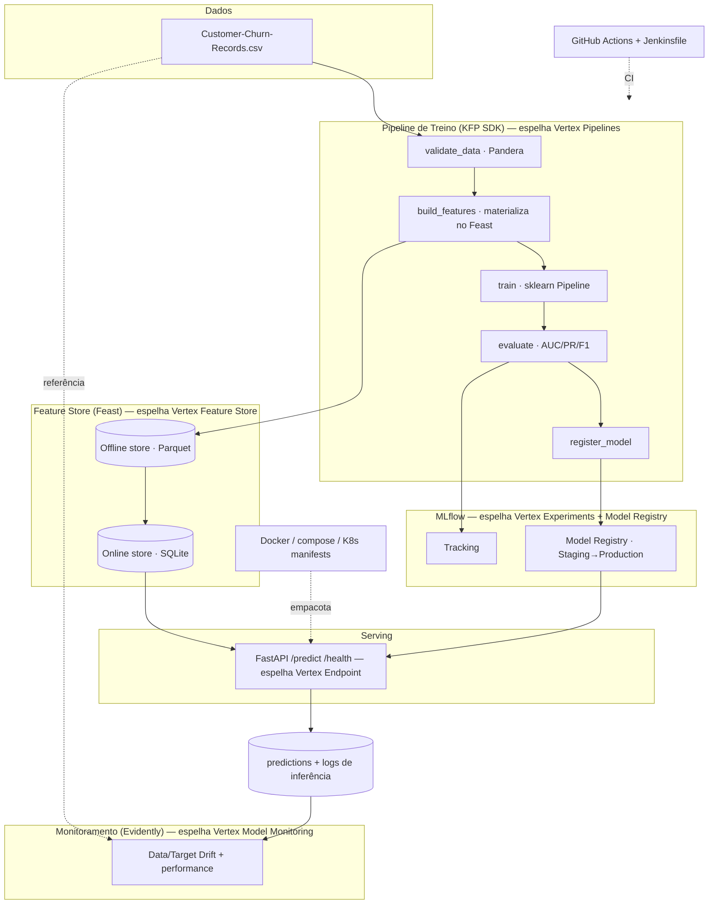

# Design — Pipeline MLOps de Churn (Teste Técnico Bulla)

- **Data:** 2026-08-15
- **Autor:** Danilo Marano (com Claude Code)
- **Status:** Aprovado — pronto para plano de implementação
- **Contexto:** Teste técnico para vaga de Machine Learning Engineer (MLOps) na Bulla.

---

## 1. Objetivo e princípio norteador

Produtizar um modelo de previsão de **churn/turnover de clientes** (regressão logística) que hoje vive
em dois scripts soltos (`train_model_churn.py`, `infer_model_churn.py`), transformando-o numa **pipeline
robusta de MLOps executável localmente**.

> **Princípio norteador:** reproduzir localmente o ciclo de vida de ML do **Vertex AI** (a stack da vaga),
> usando equivalentes open-source, e provar que **cada bug conceitual do script original é resolvido por
> uma prática concreta de MLOps**.

Restrições do teste:

- Executável **localmente**, sem integração com provedores cloud.
- **Não** trocar a regressão logística por algo mais complexo (XGBoost etc.) nem caçar hiperparâmetro.
  O foco é a **pipeline de MLOps e o ciclo de vida do modelo**.

Tensão central que a solução resolve: a vaga é fortemente **Vertex AI / GCP**, mas o teste proíbe cloud.
A resposta é montar equivalentes locais com **mapeamento 1:1** documentado.

## 2. Auditoria do código original (problemas conceituais encontrados)

| # | Problema | Gravidade | Onde |
|---|----------|-----------|------|
| 1 | **Target leakage:** `geography_churn_rate` calculada com a média do `turnover` sobre o dataset **inteiro antes do split** — o modelo "vê" o teste durante o treino. | Crítico | `train_model_churn.py:36` |
| 2 | **Train/serve skew:** `StandardScaler`, `LabelEncoder` e `qcut` são **re-fitados na inferência** em vez de persistidos. Só `model.pkl` é salvo; o pré-processamento não. Os números que entram no modelo em produção diferem dos do treino. | Crítico | `infer_model_churn.py:22-50` |
| 3 | **`CustomerId` como feature** — identificador sem poder preditivo; ruído/leakage. | Alto | ambos, lista `features` |
| 4 | **`surname_encoded`** — `LabelEncoder` no sobrenome (altíssima cardinalidade), não generaliza e é re-fitado com ordem diferente na inferência. | Alto | ambos |
| 5 | **Métrica enganosa:** `accuracy` numa base ~20% churn. Prever "ninguém sai" já dá ~80%. Sem AUC/precision/recall. | Alto | `train_model_churn.py:91` |
| 6 | **`train_test_split` sem `random_state` nem `stratify`** — não reproduzível e sem preservar a proporção de classes numa base desbalanceada. | Médio | `train_model_churn.py:79` |
| 7 | **`churn_rate_por_uf` hardcoded** na inferência, com códigos de `Geography` que nem batem com o `LabelEncoder` re-fitado. | Médio | `infer_model_churn.py:32-37` |
| 8 | **`model.pkl` via pickle simples** — sem versão, metadados, assinatura de features ou estágio (staging/prod). | Médio | ambos |
| 9 | **Score de retenção** calculado no treino (`probs_ficar * 10`) e **descartado**; regra duplicada entre treino e inferência. | Baixo | `train_model_churn.py:96` |
| 10 | **Sem `Pipeline` do sklearn** encapsulando preprocessing + modelo; sem validação de schema de entrada; sem testes. | Estrutural | ambos |

> Observação de dados: o dataset é o conhecido *Bank Customer Churn* (adaptado com praças BR). A coluna
> `Complain` tem correlação quase perfeita com `turnover` e **corretamente** já vem comentada nas features —
> mantemos comentada e documentamos o porquê (seria leakage de rótulo).

## 3. Arquitetura



### Mapeamento Vertex AI → equivalente local

| Componente Vertex AI (vaga) | Equivalente local (entrega) | Papel |
|---|---|---|
| Vertex Pipelines | **KFP SDK** (mesma engine) | Orquestra as etapas do treino |
| Vertex AI Experiments | **MLflow Tracking** | Rastreia params/métricas/artefatos |
| Vertex Model Registry | **MLflow Model Registry** | Versiona e promove modelos |
| Vertex Feature Store | **Feast** | Serve features offline/online sem skew |
| Vertex Model Monitoring | **Evidently AI** | Detecta data/target drift |
| Vertex Endpoint | **FastAPI + Docker** | Serve predições REST |
| Cloud Build / Vertex CI | **GitHub Actions + Jenkinsfile** | CI/CD |

## 4. Estrutura de diretórios

```
bulla-churn-mlops/
├── Makefile                    # make setup/train/serve/test/monitor/pipeline
├── pyproject.toml              # deps via uv
├── .env.example                # config (pydantic-settings)
├── README.md                   # auditoria + arquitetura + como rodar
├── docker/
│   ├── Dockerfile
│   ├── docker-compose.yml      # MLflow server + API + monitor
│   └── k8s/                    # deployment.yaml + service.yaml (documentado)
├── Jenkinsfile                 # CI equivalente (a vaga cita Jenkins)
├── .github/workflows/ci.yml    # CI real
├── src/churn/
│   ├── config.py               # Settings tipadas
│   ├── schema.py               # Pandera (CSV) + Pydantic (API)
│   ├── features/
│   │   ├── definitions.py      # Feature views do Feast
│   │   └── build.py            # feature engineering SEM leakage
│   ├── pipeline/
│   │   ├── components.py       # componentes KFP
│   │   └── churn_pipeline.py   # DAG KFP
│   ├── training/
│   │   ├── train.py            # sklearn Pipeline
│   │   └── evaluate.py         # métricas honestas
│   ├── serving/
│   │   └── api.py              # FastAPI + MLflow Registry
│   ├── monitoring/
│   │   └── drift.py            # Evidently
│   └── scoring.py              # prob→score 0–10 (regra única)
├── feature_repo/               # feature_store.yaml (Feast, provider local)
├── notebooks/
│   └── 00_audit_original.ipynb # auditoria reprodutível dos bugs
├── docs/
│   └── tensorflow_variant.md   # o mesmo modelo em TF/Keras
├── legacy/                     # scripts originais preservados p/ referência
└── tests/                      # pytest
```

## 5. Componentes (o que faz · como usa · do que depende)

- **`schema.py` — contrato de dados.** Pandera valida o CSV (tipos, ranges, categorias, nulos) antes do
  treino; Pydantic valida o payload da API. Fecha o bug #10. *Dep.:* pandera, pydantic.
- **`features/build.py` — feature engineering sem leakage.** Toda transformação que "aprende" dos dados
  (scaler, encoders, `geography_churn_rate`) é `fit` **apenas no treino**. Fecha #1 e #2. *Dep.:* pandas, sklearn.
- **Feature Store (Feast).** Features de agregação (ex.: taxa de churn por geografia, computada offline com
  dados de treino) materializadas no offline store (Parquet) e servidas online (SQLite). **É a resposta
  conceitual ao bug #1:** features computadas offline, servidas consistentemente online. Fecha #1 e #7.
  *Dep.:* feast.
- **Pipeline KFP (`pipeline/`).** validate→build_features→train→evaluate→register como componentes KFP
  compilados numa DAG; o mesmo `.yaml` subiria no Vertex Pipelines. Fecha #10. *Dep.:* kfp.
- **Treino (`training/train.py`).** Um `sklearn.Pipeline` = `ColumnTransformer` (OneHot categóricas +
  StandardScaler numéricas) + `LogisticRegression(max_iter=500, class_weight="balanced")`, persistido
  inteiro. Remove `CustomerId` e `surname_encoded`. `train_test_split(random_state=42, stratify=y)`.
  Fecha #2, #3, #4, #6. *Dep.:* sklearn, mlflow.
- **Avaliação (`training/evaluate.py`).** AUC-ROC, precision, recall, F1, matriz de confusão; tudo no
  MLflow. Fecha #5. *Dep.:* sklearn, mlflow.
- **MLflow.** Cada treino é um run rastreado; modelo aprovado promovido Staging→Production; a API carrega
  sempre a versão Production. Fecha #8. *Dep.:* mlflow.
- **Serving (`serving/api.py`).** FastAPI `/predict` (single e batch) + `/health`; carrega modelo do
  Registry e features do online store do Feast; retorna `turnover_pred` + `score_retencao`. *Dep.:*
  fastapi, uvicorn, mlflow, feast.
- **Scoring (`scoring.py`).** Função única `prob_ficar → round(prob*10)`, importada por treino, batch e API.
  Fecha #9. *Dep.:* numpy.
- **Monitoramento (`monitoring/drift.py`).** Evidently compara referência (treino) vs. produção — data
  drift, target drift, performance. *Dep.:* evidently.
- **CI/CD.** `.github/workflows/ci.yml` (lint ruff + pytest + build) e `Jenkinsfile` de exemplo.

## 6. Como cada bug é fechado (rastreabilidade)

| Bug (§2) | Correção |
|---|---|
| #1 leakage geography | Feature computada só no treino, materializada/servida via Feast |
| #2 skew | Tudo dentro de `sklearn.Pipeline` persistido; nada re-fitado |
| #3 CustomerId | Removido das features |
| #4 surname_encoded | Removido das features |
| #5 accuracy | AUC + precision/recall + F1 + matriz |
| #6 split | `random_state=42`, `stratify=y` |
| #7 churn_rate hardcoded | Substituído pela feature servida do Feast |
| #8 pickle solto | MLflow Model Registry com assinatura e estágios |
| #9 score descartado/duplicado | `scoring.py` único e testado |
| #10 sem pipeline/validação/testes | KFP + Pandera/Pydantic + pytest |

## 7. Decisão sobre o classificador (sklearn vs. TensorFlow)

A vaga pede **TensorFlow**; o teste proíbe trocar o algoritmo. Solução: manter **LogisticRegression do
sklearn** como modelo entregue (integra melhor com Pipeline/MLflow e respeita o teste) e documentar em
`docs/tensorflow_variant.md` como o **mesmo** modelo seria em TF/Keras — uma regressão logística é
literalmente uma camada densa única com ativação sigmoid e perda `binary_crossentropy`. Isso demonstra
domínio de TF sem violar a restrição nem aumentar risco.

## 8. Testes (pytest)

- **Schema:** CSV e payload inválidos são rejeitados.
- **No-leakage:** o `fit` das features não usa dados de teste.
- **Reprodutibilidade:** mesmo seed → mesmas métricas.
- **API contract:** `/predict` retorna o schema esperado; `/health` responde 200.
- **Scoring:** limites (prob 0→score 0; prob 1→score 10).
- **Drift:** dataset deslocado dispara alerta do Evidently.

## 9. Como rodar (experiência do usuário final)

```bash
make setup      # uv sync + .env + inicializa Feast + sobe MLflow local
make pipeline   # pipeline KFP: valida→features→treina→avalia→registra
make serve      # sobe a API FastAPI (modelo Production do MLflow)
make monitor    # relatório de drift (Evidently)
make test       # pytest
# alternativa: docker compose up  → MLflow + API + monitor
```

## 10. Stack e amarração com a vaga

Python + **uv** · scikit-learn · **KFP** (=Vertex Pipelines) · **MLflow** (=Vertex Experiments+Registry) ·
**Feast** (=Vertex Feature Store) · **Evidently** (=Vertex Monitoring) · **FastAPI** (=Vertex Endpoint) ·
**Docker/K8s** · **GitHub Actions + Jenkinsfile** · **Pandera/Pydantic** · **pytest** · **Makefile** ·
**TensorFlow** (documentado).

## 11. Plano de entrega em fases (commits pequenos)

1. **Scaffold** — uv, estrutura, Makefile, config, `.env.example`, mover originais p/ `legacy/`, auditoria no README/notebook.
2. **Dados & features** — schema Pandera + `build.py` sem leakage + Feast.
3. **Treino & avaliação** — sklearn Pipeline + métricas + MLflow tracking/registry.
4. **Pipeline KFP** — componentes + DAG.
5. **Serving** — FastAPI + scoring + Docker.
6. **Monitoramento** — Evidently.
7. **CI/CD & docs** — GitHub Actions, Jenkinsfile, K8s, README final, `tensorflow_variant.md`.

## 12. Fora de escopo (YAGNI)

- Troca do algoritmo / tuning de hiperparâmetros (proibido pelo teste).
- Integração real com GCP/cloud (proibido pelo teste; só documentamos a equivalência).
- MongoDB/NoSQL como store de produção (mencionado na vaga, mas overkill local; citado como evolução).
- Autenticação/HTTPS na API (fora do escopo de um teste local).
